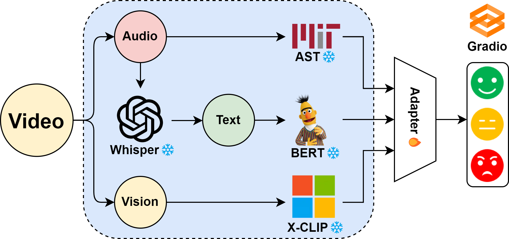

# Chinese-Multimodal-Sentiment-Analysis



## Introduction

Chinese-Multimodal-Sentiment-Analysis is a comprehensive repository dedicated to advancing the field of sentiment analysis using multimodal data inputs, focusing on Chinese language data. This repository houses code, datasets, and models that integrate and analyze textual, audio, and visual information to understand and predict sentiments in Chinese multimedia content.

## Objective

The primary objective of this repository is to provide resources and tools for researchers and practitioners to perform sentiment analysis in Chinese, leveraging the power of multimodal learning techniques. This includes handling complex linguistic phenomena and capturing nuanced emotional expressions.

## Installation

To get started with Chinese-Multimodal-Sentiment-Analysis, clone the repository and install the required dependencies:

```bash
git clone https://github.com/yourusername/Chinese-Multimodal-Sentiment-Analysis.git
cd Chinese-Multimodal-Sentiment-Analysis
pip install -r requirements.txt
```

## Dataset

### CH-SIMS Dataset

The Chinese Multimodal Sentiment Analysis project utilizes the CH-SIMS dataset, a comprehensive collection for Chinese sentiment analysis using multimodal data.

CH-SIMS dataset uses feature files that are organized as follows:

```python
{
    "train": {
        "raw_text": [],              # raw text
        "audio": [],                 # audio feature
        "vision": [],                # video feature
        "id": [],                    # [video_id$_$clip_id, ..., ...]
        "text": [],                  # bert feature
        "text_bert": [],             # word ids for bert
        "audio_lengths": [],         # audio feature lenth(over time) for every sample
        "vision_lengths": [],        # same as audio_lengths
        "annotations": [],           # strings
        "classification_labels": [], # Negative(0), Neutral(1), Positive(2). Deprecated in v_2.0
        "regression_labels": []      # Negative(<0), Neutral(0), Positive(>0)
    },
    "valid": {***},                  # same as "train"
    "test": {***},                   # same as "train"
}
```

#### Overview

CH-SIMS is a richly annotated dataset that includes a variety of video clips with corresponding textual transcriptions and audio data. It is specifically designed for the analysis of sentiment in the Chinese language using a multimodal approach, integrating text, audio, and visual information.

#### Features

- **Multimodal Annotations**: Each segment in the dataset is annotated with sentiments based on multimodal information, providing insights from text, audio, and visual modalities.
- **Diverse Sources**: The dataset includes video segments from movies, TV series, and other multimedia sources, ensuring a diverse range of expressions and contexts.
- **Fine-Grained Analysis**: CH-SIMS supports fine-grained sentiment analysis, allowing for a detailed understanding of emotional states and nuances in Chinese language content.

#### Download

The dataset can be accessed from [CH-SIMS repository](https://github.com/thuiar/MMSA) or a similar source.

The use of the CH-SIMS dataset in this project allows for an in-depth exploration and analysis of sentiment in the Chinese context, leveraging the strengths of multimodal data to achieve more accurate and nuanced sentiment analysis results.

## Model

### Adapter Models for Multimodal Feature Fusion

The Chinese-Multimodal-Sentiment-Analysis project leverages advanced adapter models to effectively combine and analyze features from different modalities, including text, audio, and video. These models play a pivotal role in the comprehensive sentiment analysis process, ensuring that all aspects of the data are utilized optimally.

#### Training the Adapter Models

To train the adapter models with your dataset, follow the command below. This command will initiate the training process, taking into consideration the multimodal nature of the dataset and applying appropriate feature fusion techniques.

To train the adaptor models, use the following command:
```python
python main.py \
  --batch_size 64 \
  --lr 5e-5 \
  --eposhs 100 \
  --early_stop 20 \
  --model_save_to ./fusion_model.pth 
```
#### Command Line Arguments:
- `--batch_size`: Size of each training batch.
- `--lr`: Learning rate for the training process.
- `--epochs`: Number of epochs for model training.
- `--early_stop`: Early stopping criteria to prevent overfitting.
- `--model_save_to`: Path where the trained model will be saved.

## Usage

To illustrate, suppose you have a new set of data for sentiment analysis and the trained fusion model saved as `./fusion_model.pth`. You can analyze the sentiment of this data by executing:
```python
python demo.py --fusion_model ./fusion_model.pth 
```

## Results

- CH-SIMS

|    Model   |                                          From                                          | Acc_3     | F1-score_3 |
| :--------: | :------------------------------------------------------------------------------------: | :-------: | :--------: |
| EF LSTM    |               [MultimodalDNN](https://github.com/rhoposit/MultimodalDNN)               | 54.27     | 38.18      |
| LF DNN     |               [MultimodalDNN](https://github.com/rhoposit/MultimodalDNN)               | 70.20     | 65.29      |
| TFN        |        [Tensor-Fusion-Network](https://github.com/A2Zadeh/TensorFusionNetwork)         | 65.95     | 62.04      |
| LMF        | [Low-rank-Multimodal-Fusion](https://github.com/Justin1904/Low-rank-Multimodal-Fusion) | 66.87     | 62.46      |
| MFN        |               [Memory-Fusion-Network](https://github.com/pliang279/MFN)                | 54.14     | 67.57      |
| Graph MFN  |    [Graph-Memory-Fusion-Network](https://github.com/A2Zadeh/CMU-MultimodalSDK/)        | 68.44     | 63.44      |
| MulT       |      [Multimodal-Transformer](https://github.com/yaohungt/Multimodal-Transformer)      | 68.27     | 64.23      |
| MISA       |                      [MISA](https://github.com/declare-lab/MISA)                       | 67.05     | 60.98      |
| MLF DNN    |                         [MMSA](https://github.com/thuiar/MMSA)                         | 70.37     | 65.94      |
| MTFN       |                         [MMSA](https://github.com/thuiar/MMSA)                         | 70.28     | 66.44      |
| MLMF       |                         [MMSA](https://github.com/thuiar/MMSA)                         | 71.60     | 70.45      |
| **Ours**   |                                                                                        | **72.87** | **71.03**  |
## Contributing

We welcome contributions to the Chinese-Multimodal-Sentiment-Analysis repository. If you have suggestions, bug reports, or want to contribute code or documentation, please submit a pull request or open an issue.

## Acknowledgments

This repository builds upon the work and findings of various research papers and datasets, including the CH-SIMS dataset and associated research. We thank all the contributors and researchers in the field for their valuable insights and contributions.

